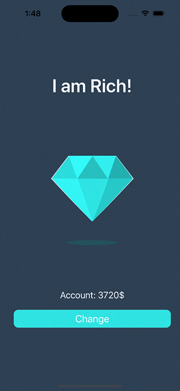

# Main Screen

<!--  -->


**MainViewController**

```swift
import UIKit
import SnapKit
import Lottie

class MainViewController: UIViewController {
    
    private let stackView: UIStackView = {
        let stackView = UIStackView()
        stackView.translatesAutoresizingMaskIntoConstraints = false
        stackView.axis = .vertical
        stackView.spacing = 20
        return stackView
    }()
    
    private let animationView: LottieAnimationView = {
        let view = LottieAnimationView()
        view.animation = LottieAnimation.named("diamond")
        return view
    }()
    
    private let mainLabel: UILabel = {
        let label = UILabel()
        label.translatesAutoresizingMaskIntoConstraints = false
        label.text = "I am Rich!"
        label.font = .boldSystemFont(ofSize: 40)
        label.textAlignment = .center
        label.textColor = .white
        return label
    }()
    
    private let accountMoneyLabel: UILabel = {
        let label = UILabel()
        label.translatesAutoresizingMaskIntoConstraints = false
        label.textAlignment = .center
        label.textColor = .white
        label.font = .systemFont(ofSize: 20)
        label.text = "Account: 0$"
        return label
    }()
    
    private let mainButton: UIButton = {
        let button = UIButton(type: .system)
        button.translatesAutoresizingMaskIntoConstraints = false
        button.backgroundColor = UIColor(red: 47/255, green: 227/255, blue: 227/255, alpha: 1)
        button.setTitleColor(UIColor(white: 1, alpha: 1), for: [])
        button.titleLabel?.font = UIFont.systemFont(ofSize: 22)
        button.layer.cornerRadius = 10
        button.setTitle("Change", for: .normal)
        button.addTarget(self, action: #selector(changeNumber), for: .touchUpInside)
        return button
    }()

    override init(nibName nibNameOrNil: String?, bundle nibBundleOrNil: Bundle?) {
        super.init(nibName: nil, bundle: nil)
        
    }
    
    override func viewDidLoad() {
        super.viewDidLoad()
        
        setup()
        addSubviews()
        addConstraints()
        setupAnimation()
    }
    
    required init?(coder: NSCoder) {
        fatalError("init(coder:) has not been implemented")
    }
    
    
}

// MARK: Add subviews, constraints and setup
extension MainViewController {
    
    func setup() {
        view.backgroundColor = UIColor(red: 46/255, green: 64/255, blue: 83/255, alpha: 1)
        
    }
    
    func addSubviews() {
        stackView.addArrangedSubview(mainLabel)
        stackView.addArrangedSubview(animationView)
        stackView.addArrangedSubview(accountMoneyLabel)
        stackView.addArrangedSubview(mainButton)
        
        view.addSubview(stackView)
    }
    
    func addConstraints() {
        stackView.snp.makeConstraints { make in
            make.centerX.equalTo(view.safeAreaLayoutGuide.snp.centerX)
            make.centerY.equalTo(view.safeAreaLayoutGuide.snp.centerY)
            make.leading.equalToSuperview().offset(20)
            make.trailing.equalToSuperview().offset(-20)
        }
        animationView.snp.makeConstraints { make in
            make.width.equalTo(400)
            make.height.equalTo(400)
        }
        
        mainLabel.snp.makeConstraints { make in
            make.bottom.equalTo(animationView.snp.top)
            make.leading.equalToSuperview().offset(10)
            make.trailing.equalToSuperview().offset(10)
        }
        
    }
}

// MARK: Lottie Animation
extension MainViewController {
    func setupAnimation() {
        animationView.contentMode = .scaleAspectFit
        animationView.backgroundColor = UIColor(red: 46/255, green: 64/255, blue: 83/255, alpha: 1)
        animationView.frame = view.bounds
        animationView.backgroundBehavior = .pauseAndRestore
        animationView.loopMode = .loop
        animationView.play()
    }
}

//MARK: Actions
extension MainViewController {
    @objc private func changeNumber() {
        changeToRandomNumber(change: 1)
    }
    
    private func changeToRandomNumber(change: Int) {
        accountMoneyLabel.text = "Account: \(Int.random(in: 1000..<10000))$"
    }
    
}
```
